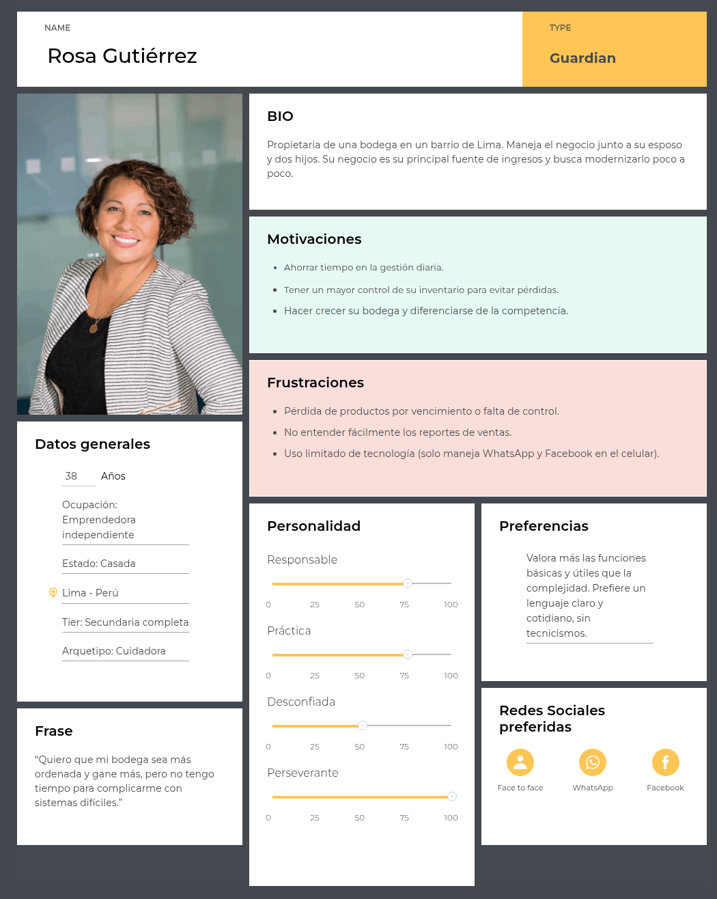
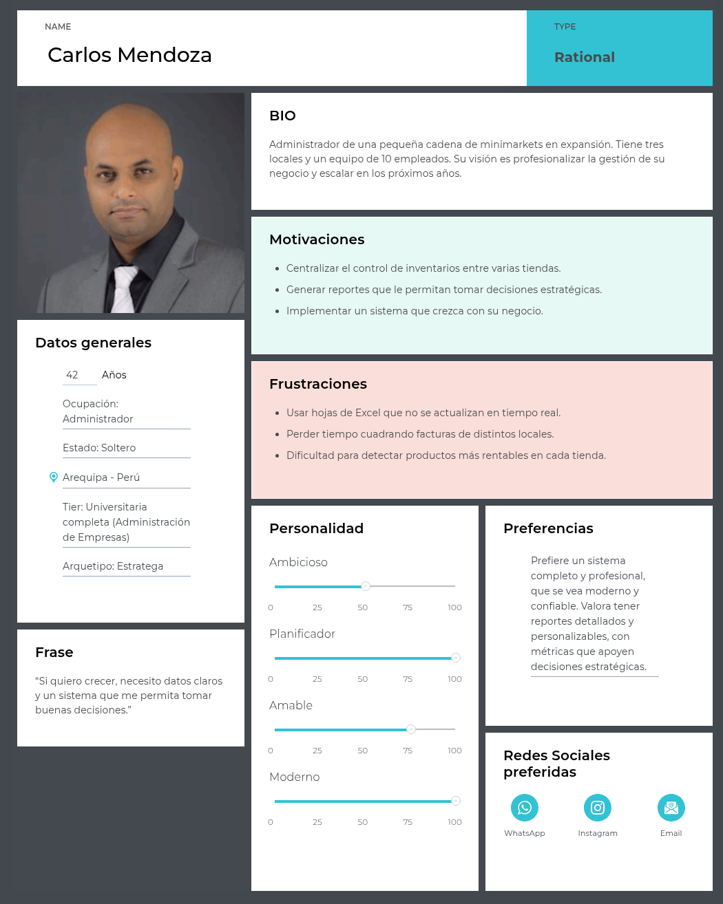
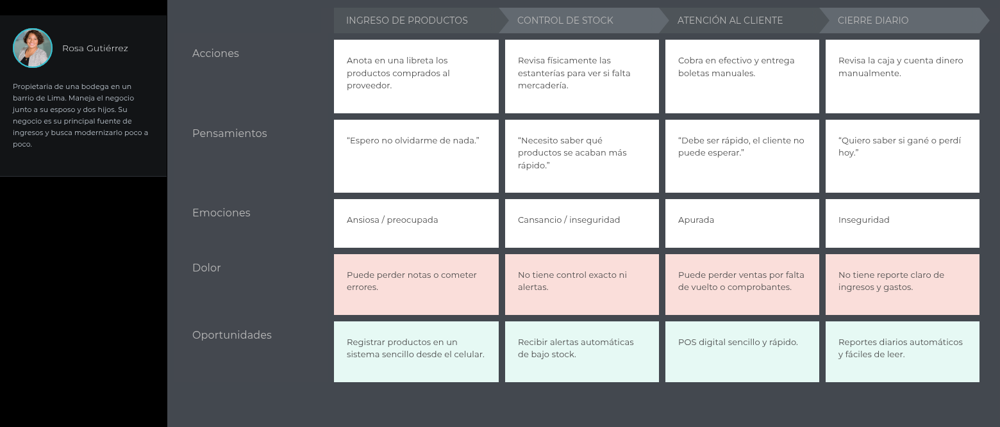
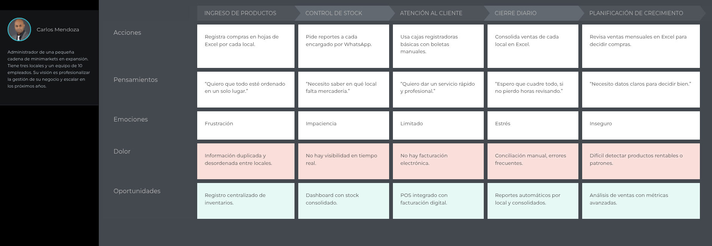

  
## Universidad Peruana de Ciencias Aplicadas

**Ingeniería de Software**

**Ciclo:** 2025-2

**Curso:** Aplicaciones Web

**Sección:** 7420

**Profesor:** Alex Humberto, Sánchez Ponce 

----

## Informe de Trabajo Final

**Startup:** FLUXA

**Nombre del producto:** WARISMASRT

#### Relación de integrantes

| Integrante                                | Código       |
|-------------------------------------------|--------------|
| Huamán Cuba, Johan Giovani                |  U202417448  |
| Tasayco Almonacid, Rafael Augusto         |  U20231f226  |
| Gutarra Velapatiño, Sebastián Ernesto     |  U20241a314  |
| Nuñez Soto, Andy Arturo                   |  U20231e795  |
| Rivas Castillo, Christoper Steven         |  U202323551  |

 
<h3>Agosto 2025</h3>
 

  

---
### Registro de Versiones

  
|**Versión**|**Fecha**|**Autor**|**Descripción de modificación**|
| - | - | - | - |

  

---

# Project Report Collaboration Insights

URL de Organización de GitHub DevWebUPC: 

URL del Repositoria del Project Report:

<strong>*Entrega TB1:*</strong>

+ Desarrollo de Actividades:
+ Evidencias de colaboracion y commits:

---
# Contenido
- [Contenido](#contenido)
- [Student Outcome](#student-outcome)
- [Capítulo 1: Introducción](#capitulo-1-introducción)
  - [1.1. Startup Profile](#11-startup-profile)
    - [1.1.1. Descripción de la StartUp](#111-descripcion-del-startup)
    - [1.1.2. Perfiles de integrantes del equipo](#112-perfiles-de-integrantes-del-equipo)
  - [1.2. Solution Profile](#12-solution-profile)
    - [1.2.1 Antecedentes y problemática](#121-antecedentes-y-problemática)
    - [1.2.2 Lean UX Process](#122-lean-ux-process)
      - [1.2.2.1 Lean UX Problem Statement](#1221-lean-ux-problem-statements)
      - [1.2.2.2 Lean UX Assumptions](#1222-lean-ux-assumptions)
      - [1.2.2.3 Lean UX Hypothesis Statements](#1223-lean-ux-hypothesis-statements)
      - [1.2.2.4 Lean UX Canvas](#1224-lean-ux-canvas)
  - [1.3. Segmentos Objetivo](#13-segmentos-objetivos)
  
- [Capítulo 2: Requirements Elicitation & Analysis](#capitulo-2-requirements-elicitation--analysis)
  - [2.1. Competidores](#21-competidores)
    - [2.1.1. Análisis competitivo](#211-analisis-competitivo)
    - [2.1.2. Estrategias y tácticas frente a competidores](#212-estrategias-y-tácticas-frente-a-competidores)
  - [2.2 Entrevistas](#22-entrevistas)
    - [2.2.1 Diseño de entrevistas](#221-diseño-de-entrevistas)
    - [2.2.2 Registro de Entrevistas](#222-registro-de-entrevistas)
    - [2.2.3. Análisis de entrevistas](#223-análisis-de-entrevistas)
  - [2.3. Needfinding](#23-needfinding)
    - [2.3.1. User Personas](#231-user-personas)
    - [2.3.2 User Task Matrix](#232--user-task-matrix)
    - [2.3.3. User Journey Mapping](#233-user-journey-mapping)
    - [2.3.4. Empathy Mapping](#234-empathy-mapping)
    - [2.3.5. As-is Scenario Mapping](#235-as-is-scenario-mapping)
  - [2.4. Ubiquitous Language](#24-ubiquitous-language)
    
- [Capítulo 3: Requirements Specification](#capitulo-3-requirements-specification)
  - [3.1. To-Be Scenario Mapping](#31-to-be-scenario-mapping)
  - [3.2. User Stories](#32-user-stories)
  - [3.3. Impact Mapping](#33-impact-mapping)
  - [3.4. Product Backlog](#34-product-backlog)

- [Capítulo 4: Product Design](#capítulo-4-product-design)
  - [4.1 Style Guidelines](#41-style-guidelines)
    - [4.1.1. General Style Guidelines](#411-general-style-guidelines)
    - [4.1.2. Web Style Guidelines](#412-web-style-guidelines)
  - [4.2. Information Architecture](#42-information-architecture)
    - [4.2.1. Organization Systems](#421-organization-systems)
    - [4.2.2. Labeling Systems](#422-labeling-systems)
    - [4.2.3. SEO Tags and Meta Tags](#423-seo-tags-and-meta-tags)
    - [4.2.4. Searching Systems](#424-searching-systems)
    - [4.2.5. Navigation Systems](#425-navigation-systems)
  - [4.3 Landing Page UI Design](#43-landing-page-ui-design)
    - [4.3.1. Landing Page Wireframe](#431-landing-page-wireframe)
    - [4.3.2. Landing Page Mock-up](#432-landing-page-mock-up)
  - [4.4 Web Applications UX/UI Design](#44-web-applications-uxui-design)
    - [4.4.1. Web Applications Wireframes](#441-web-applications-wireframes)
    - [4.4.2. Web Applications Wireflow Diagrams](#442-web-applications-wireflow-diagrams)
    - [4.4.3. Web Applications Mock-ups](#443-web-applications-mock-ups)
    - [4.4.4. Web Applications User Flow Diagrams](#444-web-applications-user-flow-diagrams)
  - [4.5. Web Applications Prototyping](#45-web-applications-prototyping)
  - [4.6. Domain-Driven Software Architecture](#46-domain-driven-software-architecture)
    - [4.6.1. Software Architecture Context Diagram](#461-software-architecture-context-diagram)
    - [4.6.2. Software Architecture Container Diagrams](#462-software-architecture-container-diagrams)
    - [4.6.3. Software Architecture Components Diagrams](#463-software-architecture-components-diagrams)
  - [4.7. Software Object-Oriented Design](#47-software-object-oriented-design)
    - [4.7.1. Class Diagrams](#471-class-diagrams)
    - [4.7.2. Class Dictionary](#472-class-dictionary)
  - [4.8. Database Design](#48-database-design)
    - [4.8.1. Database Diagram](#481-database-diagram)
    
- [Capítulo 5: Product Implementation, Validation & Deployment](#capítulo-5-product-implementation-validation--deployment)
  - [5.1. Software Configuration Management](#51-software-configuration-management)
    - [5.1.1. Software Development Environment Configuration](#511-software-development-environment-configuration)
    - [5.1.2. Source Code Management](#512-source-code-management)
    - [5.1.3. Source Code Style Guide & Conventions](#513-source-code-style-guide--conventions)
    - [5.1.4. Software Deployment Configuration](#514-software-deployment-configuration)
  - [5.2. Landing Page, Services & Applications Implementation](#52-landing-page-services--applications-implementation)
    - [5.2.1. Sprint 1](#521-sprint-1)
      - [5.2.1.1. Sprint Planning 1](#5211-sprint-planning-1)
      - [5.2.1.2. Aspect Leaders and Collaborators](#5212-aspect-leaders-and-collaborators)
      - [5.2.1.3. Sprint Backlog 1](#5213-sprint-backlog-1)
      - [5.2.1.4. Development Evidence for Sprint Review ](#5214-development-evidence-for-sprint-review)
      - [5.2.1.5. Execution Evidence for Sprint Review](#5215-execution-evidence-for-sprint-review)
      - [5.2.1.6. Services Documentation Evidence for Sprint Review](#5216-services-documentation-evidence-for-sprint-review)
      - [5.2.1.7. Software Deployment Evidence for Sprint Review](#5217-software-deployment-evidence-for-sprint-review)
      - [5.2.1.8. Team Collaboration Insights during Sprint](#5218-team-collaboration-insights-during-sprint)
      
- [Conclusiones](#conclusiones)
- [Bibliografía](#bibliografía)
- [Anexos](#anexos)

# Student Outcome
 

   
   |Criterio Específico|Acciones Realizadas|Conclusiones|
   |-------------------|-------------------|------------|
   
 

## Capitulo 1: Introducción
### 1.1. Startup Profile
  #### 1.1.1. Descripcion del Startup
  #### 1.1.2. Perfiles de Integrantes del equipo
### 1.2. Solution Profile
  #### 1.2.1. Antecedentes y problemática
  #### 1.2.2. Lean UX Process
  ##### 1.2.2.1. Lean UX Problem Statements
  ##### 1.2.2.2. Lean UX Assumptions
  ##### 1.2.2.3. Lean UX Hypothesis Statements
  ##### 1.2.2.4. Lean UX Canvas
### 1.3. Segmentos objetivos

## Capitulo 2: Requirements Elicitation & Analysis
### 2.1. Competidores

# Vendus Perú
**Descripción:**  
Vendus es una plataforma peruana de punto de venta (POS) y gestión comercial dirigida a pequeños negocios. Ofrece funcionalidades como control de inventario, facturación electrónica, gestión de productos, reportes de ventas y acceso desde dispositivos móviles. Está orientado a negocios minoristas que buscan una solución rápida y económica para digitalizar sus operaciones.  

**Debilidades:**  
- Limitada escalabilidad: Vendus está diseñado principalmente para negocios con un solo local, lo que puede dificultar su uso en cadenas con múltiples sucursales.  
- Reportes básicos: Aunque ofrece reportes de ventas, no cuenta con analítica avanzada ni visualizaciones estratégicas para toma de decisiones complejas.  
- Integración parcial: La integración entre módulos como compras, inventarios y proveedores no es completamente automatizada, lo que puede generar duplicidad de tareas.  

---

# TuFacturador
**Descripción:**  
TuFacturador es un software contable y de facturación electrónica que permite emitir comprobantes SUNAT, gestionar clientes y productos, y llevar un registro básico de ingresos y egresos. Está enfocado en emprendedores y microempresas que necesitan cumplir con la normativa tributaria sin complicaciones.  

**Debilidades:**  
- Enfoque tributario limitado: Su principal fortaleza es la facturación electrónica, pero no ofrece una solución integral para la gestión comercial (ventas, inventarios, compras, reportes).  
- Interfaz poco intuitiva: Algunos usuarios reportan dificultades para navegar entre módulos y configurar parámetros contables sin asistencia técnica.  
- Ausencia de control operativo: No incluye funcionalidades clave como POS, trazabilidad entre compras y ventas, ni gestión avanzada de inventario.  

---

# Siigo Perú
**Descripción:**  
Siigo es una solución contable y administrativa en la nube, orientada a pymes y estudios contables. Ofrece módulos de contabilidad, facturación electrónica, gestión de inventarios, ventas y reportes financieros. Tiene presencia regional y busca posicionarse como una solución integral para empresas en crecimiento.  

**Debilidades:**  
- Curva de aprendizaje elevada: Su interfaz y estructura modular requieren capacitación, lo que puede dificultar la adopción por parte de pequeños comerciantes sin experiencia tecnológica.  
- Soporte técnico inconsistente: Usuarios reportan falta de acompañamiento en los primeros días de uso, lo que afecta la experiencia inicial.  
- Limitaciones en la versión web: Algunas funcionalidades avanzadas están disponibles solo en versiones instaladas, lo que reduce la flexibilidad para negocios que operan 100% en la nube.

  #### 2.1.1. Analisis competitivo
  
  #### 2.1.2. Estrategias y tácticas frente a competidores
  
  ### Estrategia 1: Diferenciación Tecnológica
**Objetivo:** Posicionar WARISMART como una solución integral, modular y escalable frente a competidores que ofrecen herramientas aisladas o poco conectadas.  
**Tácticas:**

**Arquitectura Modular Escalable**  
Desarrollar una plataforma que permita activar módulos según el crecimiento del negocio (Inventarios, POS, Compras, Reportes, Seguridad), superando la rigidez de TuFacturadorM y Vendus.  
**Métrica clave:** Lograr que el 60% de los usuarios activen al menos 3 módulos en los primeros 90 días.

**Integración Total entre Módulos**  
Diseñar flujos conectados entre ventas, compras e inventarios para evitar duplicidad de tareas, una debilidad común en Siigo y Vendus.  
**Métrica clave:** Reducir en un 50% los errores operativos reportados por usuarios en el primer mes.

### Estrategia 2: Alianzas Estratégicas
**Objetivo:** Convertir gremios, cámaras de comercio y proveedores tecnológicos en aliados clave para distribución y adopción.  
**Tácticas:**

**Alianzas con Cámaras de Comercio Locales**  
Ofrecer WARISMART como solución recomendada para digitalización de microempresas, aprovechando el impulso de PRODUCE y el ITP.  
**Métrica clave:** Obtener al menos 3 convenios institucionales en el primer semestre.

**Integración con Proveedores de Facturación Electrónica**  
Conectar WARISMART con plataformas SUNAT y socios como Nubefact o Digiflow, superando la limitación tributaria de TuFacturadorM.  
**Métrica clave:** Emitir más de 10,000 comprobantes electrónicos desde WARISMART en los primeros 6 meses.

### Estrategia 3: Enfoque en Experiencia de Usuario
**Objetivo:** Atraer a comerciantes con baja alfabetización digital, ignorados por Siigo y TuFacturadorM (interfaces complejas).  
**Tácticas:**

**Onboarding Simplificado**  
Diseñar un flujo de activación en 3 pasos con tutoriales visuales y asistencia contextual.  
**Métrica clave:** Reducir la tasa de abandono en el primer uso del 40% al 15%.

**Interfaz Adaptada a Microempresas**  
Diseñar pantallas con lenguaje comercial, íconos claros y navegación móvil-first.  
**Métrica clave:** Lograr que el 70% de los usuarios operen WARISMART desde dispositivos móviles al menos una vez al día.

### Estrategia 4: Expansión Geográfica y de Mercado
**Objetivo:** Capitalizar oportunidades en regiones fuera de Lima y en verticales minoristas no atendidos por Siigo o Vendus.  
**Tácticas:**

**Modelo B2B2C con Distribuidores Locales**  
Ofrecer WARISMART a distribuidores de hardware POS y redes de capacitación MYPE.  
**Métrica clave:** Alcanzar presencia en 10 regiones del Perú en el primer año.

**Verticalización por Rubro**  
Diseñar versiones específicas para bodegas, ferreterías, licorerías y tiendas de mascotas, con flujos adaptados.  
**Métrica clave:** Lograr que el 40% de los nuevos usuarios provengan de rubros verticalizados.

### Estrategia 5: Mitigación de Amenazas
**Objetivo:** Neutralizar riesgos regulatorios, técnicos y de percepción frente a competidores con historial limitado de soporte o seguridad.  
**Tácticas:**

**Certificaciones de Seguridad y Privacidad**  
Obtener ISO 27001 y cumplir con estándares SUNAT y GDPR, contrastando con la falta de transparencia de Siigo y TuFacturador.  
**Métrica clave:** Publicar auditorías semestrales de seguridad y uso de datos.

**Contenido de Transparencia y Casos de Éxito**  
Publicar testimonios de negocios reales que escalaron con WARISMART, reforzando confianza frente a soluciones genéricas.  
**Métrica clave:** Generar 20 casos documentados en el primer año.

### Resumen de Acciones Clave
| Competidor     | Debilidad a Explotar                                   | Táctica de WARISMART                                |
|----------------|--------------------------------------------------------|----------------------------------------------------|
| Vendus Perú    | Escalabilidad limitada y reportes básicos            | Módulos activables + reportes visuales avanzados  |
| TuFacturador   | Enfoque tributario sin gestión operativa             | Integración contable + flujos comerciales conectados |
| Siigo Perú     | Curva de aprendizaje elevada y soporte inconsistente | Onboarding simplificado + interfaz móvil adaptada |

### 2.2. Entrevistas
  #### 2.2.1. Diseño de entrevistas
  #### 2.2.2. Registro de entrevistas
  #### 2.2.3. Análisis de entrevistas
### 2.3. Needfinding
  #### 2.3.1. User Personas
  **Segmento objetivo 1 – Rosa Gutiérrez:**  
Este perfil se construyó a partir del segmento objetivo de emprendedores independientes, representado por propietarios de bodegas. Busca reflejar a usuarios que manejan negocios pequeños, con bajo nivel tecnológico, cuyas necesidades principales son la simplicidad, el control básico de inventarios y la facilidad de uso.

**Segmento objetivo 2 – Carlos Mendoza:**  
Este perfil se construyó a partir del segmento objetivo de pequeñas cadenas en expansión, representado por administradores de minimarkets con varios locales. Se enfoca en usuarios con mayor conocimiento tecnológico y visión de crecimiento, que requieren un sistema escalable, con funciones de análisis y gestión de tareas.

  #### 2.3.2  User Task Matrix
  En el siguiente User Task Matrix se presentan las tareas cotidianas que realizan los dos segmentos considerados: emprendedores independientes y pequeñas cadenas en expansión.

| Tarea                                | Rosa – Importancia | Rosa – Frecuencia | Carlos – Importancia | Carlos – Frecuencia |
|--------------------------------------|------------------|-----------------|--------------------|------------------|
| Registrar productos que entran al negocio | 🔴               | 🟡              | 🔴                 | 🔴               |
| Controlar stock disponible            | 🔴               | 🟡              | 🔴                 | 🔴               |
| Verificar precios de venta            | 🔴               | 🟡              | 🔴                 | 🔴               |
| Atender ventas y emitir comprobantes  | 🔴               | 🔴              | 🔴                 | 🔴               |
| Revisar ingresos y gastos diarios     | 🔴               | 🟡              | 🔴                 | 🟡               |
| Identificar productos más vendidos    | 🟡               | 🟢              | 🔴                 | 🟡               |
| Organizar pedidos a proveedores       | 🟡               | 🟡              | 🔴                 | 🔴               |
| Conciliar información de distintos locales | ⬜             | ⬜              | 🔴                 | 🟢               |
| Planificar crecimiento del negocio    | 🟡               | 🟢              | 🔴                 | 🟡               |

**Leyenda:**  
- 🔴 = Alta  
- 🟡 = Media  
- 🟢 = Baja  
- ⬜ = N/A  

Las tareas que más se repiten y que tienen más importancia para los dos segmentos son registrar los productos que entran, controlar el stock y atender las ventas con sus comprobantes. Estas actividades son básicas y necesarias para que el negocio funcione bien cada día.  
La diferencia principal está en que Rosa, como dueña de bodega, se concentra en el trabajo diario y en mantener el orden simple de su negocio, mientras que Carlos, al manejar varios locales, necesita además organizar la información de sus tiendas, ver qué productos dejan más ganancia y pensar en cómo hacer crecer su empresa. Aun así, los dos coinciden en que lo más importante es tener control sobre el inventario, los precios y las ventas, aunque lo hagan con distinta profundidad.

  #### 2.3.3. User Journey Mapping
  **Segmento objetivo 1 – Rosa Gutiérrez:**  
Este User Journey Map se elaboró a partir del segmento objetivo de emprendedores independientes. Busca reflejar el recorrido actual de estos usuarios en la gestión de sus negocios. Se muestran las etapas end-to-end que atraviesan para llevar un control de ventas e inventarios con los recursos disponibles.

**Segmento objetivo 2 – Carlos Mendoza:**  
Este User Journey Map se construyó a partir del segmento objetivo de pequeñas cadenas en expansión. El mapa describe las acciones end-to-end y dificultades que enfrentan actualmente al intentar coordinar sus operaciones entre varias tiendas.

  #### 2.3.4. Empathy Mapping
  #### 2.3.5. As-is Scenario Mapping
### 2.4. Ubiquitous Language   

## Capitulo 3: Requirements Specification 
### 3.1. To-Be Scenario Mapping
### 3.2. User Stories
### 3.3. Impact Mapping
### 3.4. Product Backlog

## Capítulo 4: Product Design
### 4.1. Style Guidelines
  #### 4.1.1. General Style Guidelines  
  #### 4.1.2. Web Style Guidelines
### 4.2. Information Architecture
  #### 4.2.1. Organization Systems 
  #### 4.2.2. Labeling Systems 
  #### 4.2.3. SEO Tags and Meta Tags
  #### 4.2.4. Searching Systems
  #### 4.2.5. Navigation Systems  
### 4.3. Landing Page UI Design
  #### 4.3.1. Landing Page Wireframe  
  #### 4.3.2. Landing Page Mock-up 
### 4.4. Web Applications UX/UI Design
  #### 4.4.1. Web Applications Wireframes  
  #### 4.4.2. Web Applications Wireflow Diagrams  
  #### 4.4.3. Web Applications Mock-ups  
  #### 4.4.4. Web Applications User Flow Diagrams  
### 4.5. Web Applications Prototyping.
### 4.6. Domain-Driven Software Architecture
  #### 4.6.1. Software Architecture Context Diagram  
  #### 4.6.2. Software Architecture Container Diagrams  
  #### 4.6.3. Software Architecture Components Diagrams
### 4.7. Software Object-Oriented Design
  #### 4.7.1. Class Diagrams  
  #### 4.7.2. Class Dictionary 
### 4.8. Database Design
  #### 4.8.1. Database Diagram 

  ## Capítulo 5: Product Implementation, Validation & Deployment
### 5.1. Software Configuration Management
  #### 5.1.1. Software Development Environment Configuration  
  #### 5.1.2. Source Code Management  
  #### 5.1.3. Source Code Style Guide & Conventions  
  #### 5.1.4. Software Deployment Configuration
### 5.2. Landing Page, Services & Applications Implementation
### 5.2.1. Sprint 1
#### 5.2.1.1. Sprint Planning 1  
#### 5.2.1.2. Aspect Leaders and Collaborators  
#### 5.2.1.3. Sprint Backlog 1  
#### 5.2.1.4. Development Evidence for Sprint Review  
#### 5.2.1.5. Execution Evidence for Sprint Review  
#### 5.2.1.6. Services Documentation Evidence for Sprint Review  
#### 5.2.1.7. Software Deployment Evidence for Sprint Review  
#### 5.2.1.8. Team Collaboration Insights during Sprint

## Conclusiones
## Anexos
## Bibliografía
