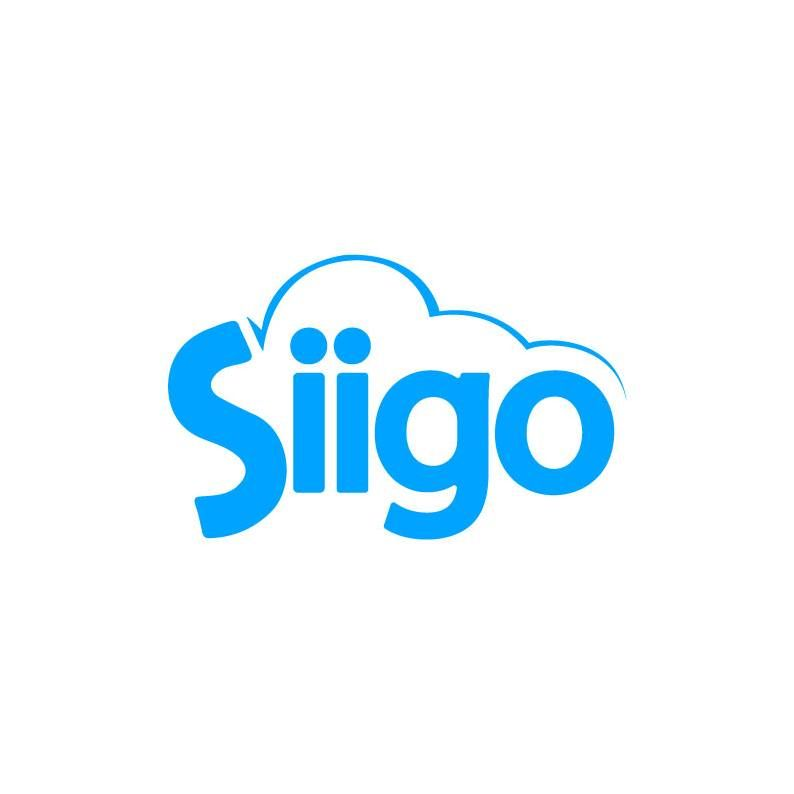
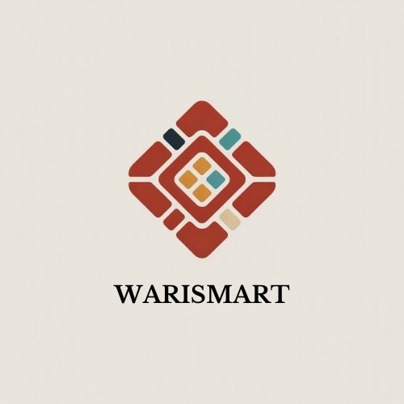
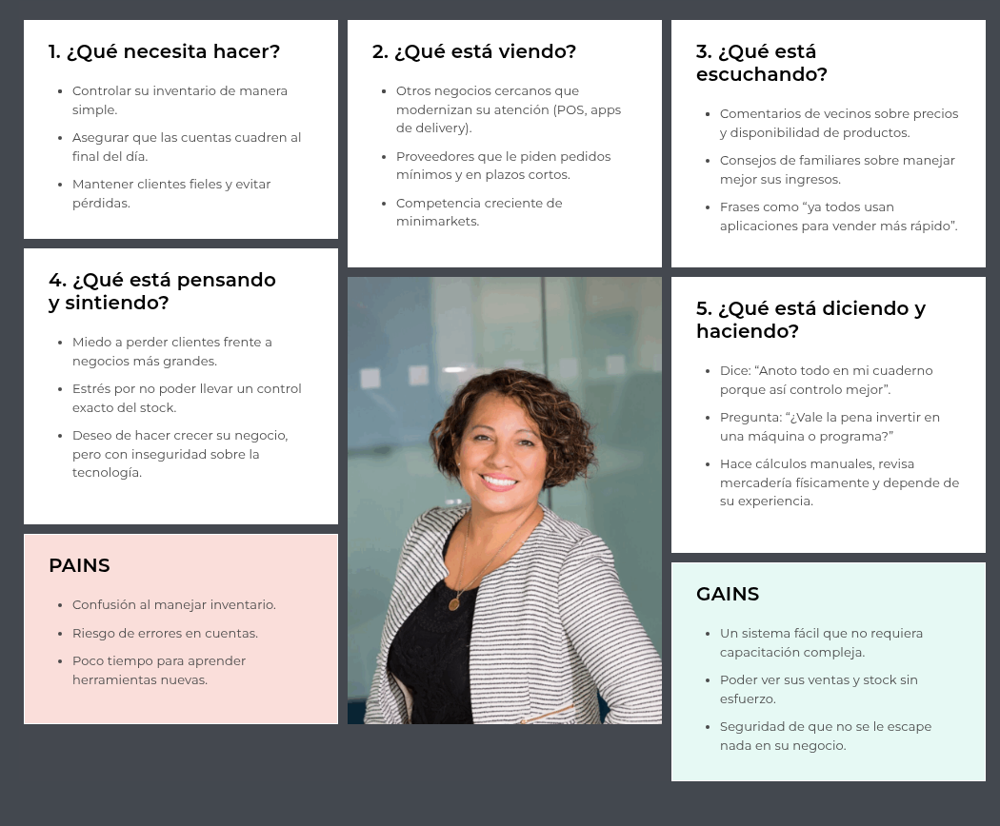
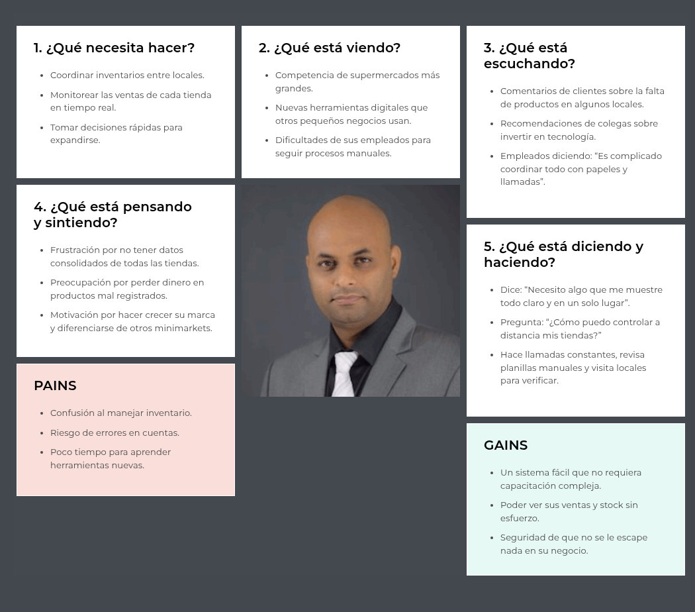
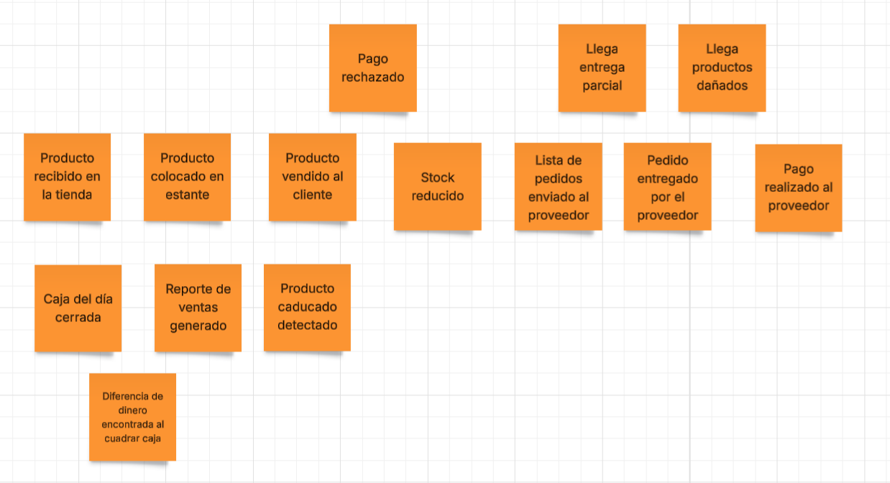
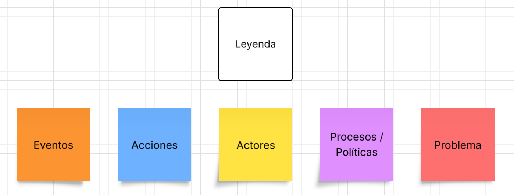
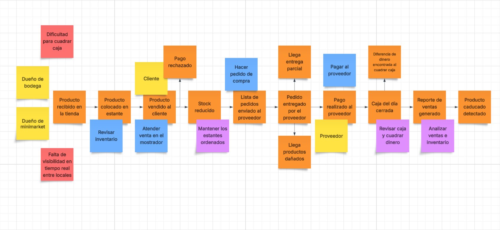

  
## Universidad Peruana de Ciencias Aplicadas

**Ingeniería de Software**

**Ciclo:** 2025-2

**Curso:** Aplicaciones Web

**Sección:** 7420

**Profesor:** Alex Humberto, Sánchez Ponce 

----

## Informe de Trabajo Final

**Startup:** FLUXA

**Nombre del producto:** WARISMASRT

#### Relación de integrantes

| Integrante                                | Código       |
|-------------------------------------------|--------------|
| Huamán Cuba, Johan Giovani                |  U202417448  |
| Tasayco Almonacid, Rafael Augusto         |  U20231f226  |
| Gutarra Velapatiño, Sebastián Ernesto     |  U20241a314  |
| Nuñez Soto, Andy Arturo                   |  U20231e795  |
| Rivas Castillo, Christoper Steven         |  U202323551  |

 
<h3>Agosto 2025</h3>
 

  

---
### Registro de Versiones

  
|**Versión**|**Fecha**|**Autor**|**Descripción de modificación**|
| - | - | - | - |

  

---

# Project Report Collaboration Insights

URL de Organización de GitHub DevWebUPC: 

URL del Repositoria del Project Report:

<strong>*Entrega TB1:*</strong>

+ Desarrollo de Actividades:
+ Evidencias de colaboracion y commits:

---
# Contenido
- [Contenido](#contenido)
- [Student Outcome](#student-outcome)
- [Capítulo 1: Introducción](#capitulo-1-introducción)
  - [1.1. Startup Profile](#11-startup-profile)
    - [1.1.1. Descripción de la StartUp](#111-descripcion-del-startup)
    - [1.1.2. Perfiles de integrantes del equipo](#112-perfiles-de-integrantes-del-equipo)
  - [1.2. Solution Profile](#12-solution-profile)
    - [1.2.1 Antecedentes y problemática](#121-antecedentes-y-problemática)
    - [1.2.2 Lean UX Process](#122-lean-ux-process)
      - [1.2.2.1 Lean UX Problem Statement](#1221-lean-ux-problem-statements)
      - [1.2.2.2 Lean UX Assumptions](#1222-lean-ux-assumptions)
      - [1.2.2.3 Lean UX Hypothesis Statements](#1223-lean-ux-hypothesis-statements)
      - [1.2.2.4 Lean UX Canvas](#1224-lean-ux-canvas)
  - [1.3. Segmentos Objetivo](#13-segmentos-objetivos)
  
- [Capítulo 2: Requirements Elicitation & Analysis](#capitulo-2-requirements-elicitation--analysis)
  - [2.1. Competidores](#21-competidores)
    - [2.1.1. Análisis competitivo](#211-analisis-competitivo)
    - [2.1.2. Estrategias y tácticas frente a competidores](#212-estrategias-y-tácticas-frente-a-competidores)
  - [2.2 Entrevistas](#22-entrevistas)
    - [2.2.1 Diseño de entrevistas](#221-diseño-de-entrevistas)
    - [2.2.2 Registro de Entrevistas](#222-registro-de-entrevistas)
    - [2.2.3. Análisis de entrevistas](#223-análisis-de-entrevistas)
  - [2.3. Needfinding](#23-needfinding)
    - [2.3.1. User Personas](#231-user-personas)
    - [2.3.2 User Task Matrix](#232--user-task-matrix)
    - [2.3.3. User Journey Mapping](#233-user-journey-mapping)
    - [2.3.4. Empathy Mapping](#234-empathy-mapping)
    - [2.3.5. As-is Scenario Mapping](#235-as-is-scenario-mapping)
  - [2.4. Ubiquitous Language](#24-ubiquitous-language)
    
- [Capítulo 3: Requirements Specification](#capitulo-3-requirements-specification)
  - [3.1. To-Be Scenario Mapping](#31-to-be-scenario-mapping)
  - [3.2. User Stories](#32-user-stories)
  - [3.3. Impact Mapping](#33-impact-mapping)
  - [3.4. Product Backlog](#34-product-backlog)

- [Capítulo 4: Product Design](#capítulo-4-product-design)
  - [4.1 Style Guidelines](#41-style-guidelines)
    - [4.1.1. General Style Guidelines](#411-general-style-guidelines)
    - [4.1.2. Web Style Guidelines](#412-web-style-guidelines)
  - [4.2. Information Architecture](#42-information-architecture)
    - [4.2.1. Organization Systems](#421-organization-systems)
    - [4.2.2. Labeling Systems](#422-labeling-systems)
    - [4.2.3. SEO Tags and Meta Tags](#423-seo-tags-and-meta-tags)
    - [4.2.4. Searching Systems](#424-searching-systems)
    - [4.2.5. Navigation Systems](#425-navigation-systems)
  - [4.3 Landing Page UI Design](#43-landing-page-ui-design)
    - [4.3.1. Landing Page Wireframe](#431-landing-page-wireframe)
    - [4.3.2. Landing Page Mock-up](#432-landing-page-mock-up)
  - [4.4 Web Applications UX/UI Design](#44-web-applications-uxui-design)
    - [4.4.1. Web Applications Wireframes](#441-web-applications-wireframes)
    - [4.4.2. Web Applications Wireflow Diagrams](#442-web-applications-wireflow-diagrams)
    - [4.4.3. Web Applications Mock-ups](#443-web-applications-mock-ups)
    - [4.4.4. Web Applications User Flow Diagrams](#444-web-applications-user-flow-diagrams)
  - [4.5. Web Applications Prototyping](#45-web-applications-prototyping)
  - [4.6. Domain-Driven Software Architecture](#46-domain-driven-software-architecture)
    - [4.6.1. Software Architecture Context Diagram](#461-software-architecture-context-diagram)
    - [4.6.2. Software Architecture Container Diagrams](#462-software-architecture-container-diagrams)
    - [4.6.3. Software Architecture Components Diagrams](#463-software-architecture-components-diagrams)
  - [4.7. Software Object-Oriented Design](#47-software-object-oriented-design)
    - [4.7.1. Class Diagrams](#471-class-diagrams)
    - [4.7.2. Class Dictionary](#472-class-dictionary)
  - [4.8. Database Design](#48-database-design)
    - [4.8.1. Database Diagram](#481-database-diagram)
    
- [Capítulo 5: Product Implementation, Validation & Deployment](#capítulo-5-product-implementation-validation--deployment)
  - [5.1. Software Configuration Management](#51-software-configuration-management)
    - [5.1.1. Software Development Environment Configuration](#511-software-development-environment-configuration)
    - [5.1.2. Source Code Management](#512-source-code-management)
    - [5.1.3. Source Code Style Guide & Conventions](#513-source-code-style-guide--conventions)
    - [5.1.4. Software Deployment Configuration](#514-software-deployment-configuration)
  - [5.2. Landing Page, Services & Applications Implementation](#52-landing-page-services--applications-implementation)
    - [5.2.1. Sprint 1](#521-sprint-1)
      - [5.2.1.1. Sprint Planning 1](#5211-sprint-planning-1)
      - [5.2.1.2. Aspect Leaders and Collaborators](#5212-aspect-leaders-and-collaborators)
      - [5.2.1.3. Sprint Backlog 1](#5213-sprint-backlog-1)
      - [5.2.1.4. Development Evidence for Sprint Review ](#5214-development-evidence-for-sprint-review)
      - [5.2.1.5. Execution Evidence for Sprint Review](#5215-execution-evidence-for-sprint-review)
      - [5.2.1.6. Services Documentation Evidence for Sprint Review](#5216-services-documentation-evidence-for-sprint-review)
      - [5.2.1.7. Software Deployment Evidence for Sprint Review](#5217-software-deployment-evidence-for-sprint-review)
      - [5.2.1.8. Team Collaboration Insights during Sprint](#5218-team-collaboration-insights-during-sprint)
      
- [Conclusiones](#conclusiones)
- [Bibliografía](#bibliografía)
- [Anexos](#anexos)

# Student Outcome
 

   
   |Criterio Específico|Acciones Realizadas|Conclusiones|
   |-------------------|-------------------|------------|
   
 

## Capitulo 1: Introducción
### 1.1. Startup Profile
  #### 1.1.1. Descripcion del Startup
  #### 1.1.2. Perfiles de Integrantes del equipo
### 1.2. Solution Profile
  #### 1.2.1. Antecedentes y problemática
  #### 1.2.2. Lean UX Process
  ##### 1.2.2.1. Lean UX Problem Statements
  ##### 1.2.2.2. Lean UX Assumptions
  ##### 1.2.2.3. Lean UX Hypothesis Statements
  ##### 1.2.2.4. Lean UX Canvas
### 1.3. Segmentos objetivos

## Capitulo 2: Requirements Elicitation & Analysis
### 2.1. Competidores

# Vendus Perú
**Descripción:**  
Vendus es una plataforma peruana de punto de venta (POS) y gestión comercial dirigida a pequeños negocios. Ofrece funcionalidades como control de inventario, facturación electrónica, gestión de productos, reportes de ventas y acceso desde dispositivos móviles. Está orientado a negocios minoristas que buscan una solución rápida y económica para digitalizar sus operaciones.  

**Debilidades:**  
- Limitada escalabilidad: Vendus está diseñado principalmente para negocios con un solo local, lo que puede dificultar su uso en cadenas con múltiples sucursales.  
- Reportes básicos: Aunque ofrece reportes de ventas, no cuenta con analítica avanzada ni visualizaciones estratégicas para toma de decisiones complejas.  
- Integración parcial: La integración entre módulos como compras, inventarios y proveedores no es completamente automatizada, lo que puede generar duplicidad de tareas.  

---

# TuFacturador
**Descripción:**  
TuFacturador es un software contable y de facturación electrónica que permite emitir comprobantes SUNAT, gestionar clientes y productos, y llevar un registro básico de ingresos y egresos. Está enfocado en emprendedores y microempresas que necesitan cumplir con la normativa tributaria sin complicaciones.  

**Debilidades:**  
- Enfoque tributario limitado: Su principal fortaleza es la facturación electrónica, pero no ofrece una solución integral para la gestión comercial (ventas, inventarios, compras, reportes).  
- Interfaz poco intuitiva: Algunos usuarios reportan dificultades para navegar entre módulos y configurar parámetros contables sin asistencia técnica.  
- Ausencia de control operativo: No incluye funcionalidades clave como POS, trazabilidad entre compras y ventas, ni gestión avanzada de inventario.  

---

# Siigo Perú
**Descripción:**  
Siigo es una solución contable y administrativa en la nube, orientada a pymes y estudios contables. Ofrece módulos de contabilidad, facturación electrónica, gestión de inventarios, ventas y reportes financieros. Tiene presencia regional y busca posicionarse como una solución integral para empresas en crecimiento.  

**Debilidades:**  
- Curva de aprendizaje elevada: Su interfaz y estructura modular requieren capacitación, lo que puede dificultar la adopción por parte de pequeños comerciantes sin experiencia tecnológica.  
- Soporte técnico inconsistente: Usuarios reportan falta de acompañamiento en los primeros días de uso, lo que afecta la experiencia inicial.  
- Limitaciones en la versión web: Algunas funcionalidades avanzadas están disponibles solo en versiones instaladas, lo que reduce la flexibilidad para negocios que operan 100% en la nube.

  #### 2.1.1. Analisis competitivo
  ## Competitive Analysis Landscape

**¿Por qué llevar a cabo este análisis?**  
El objetivo de este análisis es identificar nuestras diferencias frente a la competencia y descubrir qué aspectos podemos mejorar o innovar para fortalecer la presencia de WARISMART en el mercado. Este análisis tiene como propósito profundizar en el conocimiento de nuestros competidores directos e indirectos, permitiéndonos evaluar la eficacia de nuestra propuesta de valor y detectar áreas en las que debemos ser cuidadosos, con el fin de posicionarnos estratégicamente frente a soluciones ya existentes.

| Aspecto / Competidor | WARISMART | VENDUS PERÚ | TuFacturador | Siigo |
|---------------------|-----------|------------|--------------|-------|
| Imagen de la empresa |  |  |  |  |
| Perfil - Overview | Plataforma integral para gestión comercial en retail (inventarios, ventas, proveedores, reportes, seguridad). | Software peruano de punto de venta y facturación electrónica. | Plataforma de facturación electrónica enfocada en cumplimiento SUNAT. | Multinacional de software ERP y contabilidad con fuerte presencia en LatAm. |
| Perfil - Ventaja Competitiva - ¿Qué valor ofrece a los clientes? | Escalable para pequeñas bodegas y grandes cadenas; ofrece eficiencia operativa, reducción de costos y control total en tiempo real. | Simplicidad y bajo costo; permite digitalización rápida de ventas e inventario. | Cumplimiento tributario con SUNAT; ofrece facturación electrónica confiable y fácil de usar. | Solución integral con respaldo regional; centraliza procesos de ventas, contabilidad, inventario y nómina. |
| Perfil de Marketing - Mercado objetivo | Bodegas, tiendas medianas y grandes cadenas retail. | Micro y pequeñas empresas. | Micro y pequeñas empresas. | PYMEs y medianas-grandes empresas. |
| Perfil de Marketing - Estrategias de marketing | Marketing digital, alianzas con asociaciones de bodegueros y retailers. | Enfoque en facilidad de uso y publicidad online. | Promoción basada en cumplimiento SUNAT y precios accesibles. | Reputación de marca, presencia en ferias y publicidad corporativa. |
| Perfil de Producto - Productos & Servicios | POS, inventario, proveedores, reportes, seguridad de datos. | Facturación, ventas, inventario, reportes básicos. | Facturación electrónica, control de caja, reportes simples. | ERP completo: facturación, contabilidad, inventario, nómina. |
| Perfil de Producto - Precios & Costos | Modelo flexible: licencias y suscripciones. | Planes económicos (accesibles para bodegas). | Bajo costo, pago por uso. | Costos medios-altos (según módulos contratados). |
| Perfil de Producto - Canales de distribución (Web y/o Móvil) | Web y móvil. | Web y móvil. | Web (principalmente). | Web y móvil |
| Análisis SWOT - Fortalezas | Escalabilidad, interfaz amigable, integración total en retail. | Bajo costo, simplicidad. | Cumplimiento normativo, simplicidad. | Amplia experiencia, variedad de módulos. |
| Análisis SWOT - Debilidades | Nueva en el mercado, requiere posicionamiento. | Limitada en funciones avanzadas. | Poco escalable para negocios medianos-grandes. | Precio alto, complejidad de uso. |
| Análisis SWOT - Oportunidades | Expansión en bodegas y retail moderno. | Crecimiento de la digitalización en bodegas. | Demanda obligatoria de facturación electrónica. | Creciente necesidad de centralizar procesos empresariales. |
| Análisis SWOT - Amenazas | Competidores establecidos, barreras de entrada. | Soluciones más completas en el mercado. | Quedar limitado frente a software más integral. | Aparición de soluciones más ágiles y económicas. |

  
  #### 2.1.2. Estrategias y tácticas frente a competidores
  
  ### Estrategia 1: Diferenciación Tecnológica
**Objetivo:** Posicionar WARISMART como una solución integral, modular y escalable frente a competidores que ofrecen herramientas aisladas o poco conectadas.  
**Tácticas:**

**Arquitectura Modular Escalable**  
Desarrollar una plataforma que permita activar módulos según el crecimiento del negocio (Inventarios, POS, Compras, Reportes, Seguridad), superando la rigidez de TuFacturadorM y Vendus.  
**Métrica clave:** Lograr que el 60% de los usuarios activen al menos 3 módulos en los primeros 90 días.

**Integración Total entre Módulos**  
Diseñar flujos conectados entre ventas, compras e inventarios para evitar duplicidad de tareas, una debilidad común en Siigo y Vendus.  
**Métrica clave:** Reducir en un 50% los errores operativos reportados por usuarios en el primer mes.

### Estrategia 2: Alianzas Estratégicas
**Objetivo:** Convertir gremios, cámaras de comercio y proveedores tecnológicos en aliados clave para distribución y adopción.  
**Tácticas:**

**Alianzas con Cámaras de Comercio Locales**  
Ofrecer WARISMART como solución recomendada para digitalización de microempresas, aprovechando el impulso de PRODUCE y el ITP.  
**Métrica clave:** Obtener al menos 3 convenios institucionales en el primer semestre.

**Integración con Proveedores de Facturación Electrónica**  
Conectar WARISMART con plataformas SUNAT y socios como Nubefact o Digiflow, superando la limitación tributaria de TuFacturadorM.  
**Métrica clave:** Emitir más de 10,000 comprobantes electrónicos desde WARISMART en los primeros 6 meses.

### Estrategia 3: Enfoque en Experiencia de Usuario
**Objetivo:** Atraer a comerciantes con baja alfabetización digital, ignorados por Siigo y TuFacturadorM (interfaces complejas).  
**Tácticas:**

**Onboarding Simplificado**  
Diseñar un flujo de activación en 3 pasos con tutoriales visuales y asistencia contextual.  
**Métrica clave:** Reducir la tasa de abandono en el primer uso del 40% al 15%.

**Interfaz Adaptada a Microempresas**  
Diseñar pantallas con lenguaje comercial, íconos claros y navegación móvil-first.  
**Métrica clave:** Lograr que el 70% de los usuarios operen WARISMART desde dispositivos móviles al menos una vez al día.

### Estrategia 4: Expansión Geográfica y de Mercado
**Objetivo:** Capitalizar oportunidades en regiones fuera de Lima y en verticales minoristas no atendidos por Siigo o Vendus.  
**Tácticas:**

**Modelo B2B2C con Distribuidores Locales**  
Ofrecer WARISMART a distribuidores de hardware POS y redes de capacitación MYPE.  
**Métrica clave:** Alcanzar presencia en 10 regiones del Perú en el primer año.

**Verticalización por Rubro**  
Diseñar versiones específicas para bodegas, ferreterías, licorerías y tiendas de mascotas, con flujos adaptados.  
**Métrica clave:** Lograr que el 40% de los nuevos usuarios provengan de rubros verticalizados.

### Estrategia 5: Mitigación de Amenazas
**Objetivo:** Neutralizar riesgos regulatorios, técnicos y de percepción frente a competidores con historial limitado de soporte o seguridad.  
**Tácticas:**

**Certificaciones de Seguridad y Privacidad**  
Obtener ISO 27001 y cumplir con estándares SUNAT y GDPR, contrastando con la falta de transparencia de Siigo y TuFacturador.  
**Métrica clave:** Publicar auditorías semestrales de seguridad y uso de datos.

**Contenido de Transparencia y Casos de Éxito**  
Publicar testimonios de negocios reales que escalaron con WARISMART, reforzando confianza frente a soluciones genéricas.  
**Métrica clave:** Generar 20 casos documentados en el primer año.

### Resumen de Acciones Clave
| Competidor     | Debilidad a Explotar                                   | Táctica de WARISMART                                |
|----------------|--------------------------------------------------------|----------------------------------------------------|
| Vendus Perú    | Escalabilidad limitada y reportes básicos            | Módulos activables + reportes visuales avanzados  |
| TuFacturador   | Enfoque tributario sin gestión operativa             | Integración contable + flujos comerciales conectados |
| Siigo Perú     | Curva de aprendizaje elevada y soporte inconsistente | Onboarding simplificado + interfaz móvil adaptada |

### 2.2. Entrevistas
En WARISMART sabemos que la verdadera transformación digital del retail no nace únicamente de la tecnología, sino de escuchar y comprender a las personas que, día a día, sostienen sus negocios. Para nosotros, era fundamental ir más allá de los números y la teoría: queríamos conocer de cerca las motivaciones, los problemas y las expectativas de quienes realmente usan estos sistemas.  

Con este propósito, realizamos entrevistas en profundidad que nos permitieron descubrir cómo viven la gestión de sus negocios y qué esperan de una solución tecnológica. Decidimos enfocarnos en dos grupos clave dentro de nuestro ecosistema:  

1. **Emprendedores independientes con un solo local comercial (28–55 años).**  
   Son dueños de bodegas, licorerías, tiendas de mascotas, ferreterías o librerías pequeñas. Este perfil suele estar muy involucrado en las operaciones diarias: atienden clientes, revisan inventario, manejan pagos y, en muchos casos, son quienes también administran la caja. Su principal interés es la simplicidad y practicidad, pues no siempre cuentan con tiempo ni conocimientos técnicos para manejar sistemas complejos. A la vez, valoran mucho las herramientas que les ayudan a tener un mejor control de ventas e inventarios sin que eso signifique más carga de trabajo.  

2. **Gestores de pequeñas cadenas en expansión (30–60 años).**  
   Son administradores de entre 2 y 5 locales, ya sea de panaderías, ópticas, juguerías, zapaterías o minimarkets locales. Este segmento enfrenta retos distintos: necesitan coordinar equipos, supervisar varias tiendas y mantener información consolidada en tiempo real. A diferencia del emprendedor independiente, buscan soluciones que les permitan delegar con confianza y tener visibilidad del negocio desde cualquier lugar. Además, valoran mucho la escalabilidad de la plataforma, ya que suelen proyectar crecer en número de locales y requieren que el sistema acompañe ese proceso.

   
  #### 2.2.1. Diseño de entrevistas
  Con el fin de comprender a profundidad a nuestros usuarios potenciales de WARISMART, realizamos entrevistas estructuradas a comerciantes independientes y gestores de pequeñas cadenas que operan en zonas urbanas de Lima con alta actividad comercial.  

Para ello, planteamos una serie de preguntas que nos permitieron mapear:  

#### Segmento 1: Emprendedor Independiente  

| **Perfil** | **Descripción** |
|------------|-----------------|
| **Dueños de negocios** | Un solo local: bodegas, licorerías, tiendas de mascotas, ferreterías o librerías pequeñas. |
| **Edad** | 28–55 años |
| **Zona** | Urbana o semiurbana |
| **Nivel tecnológico** | Bajo a medio |
| **Motivación** | Control, ahorro de tiempo, evitar pérdidas. |
| **Contexto** | Estos emprendedores suelen operar con herramientas manuales (cuadernos, Excel) y enfrentan dificultades para controlar el inventario, registrar ventas, calcular ganancias y delegar tareas. La adopción tecnológica está condicionada por la simplicidad, el costo y la confianza. |

#### Preguntas de la Entrevista – Segmento 1  

| **Preguntas para Perfil** |
|--------------------------|
| ¿Podría decirnos su nombre y apellido, por favor? xd   ¿Cuántos años tiene?   ¿En qué distrito vive actualmente?   ¿Cómo empezó su negocio? ¿Qué lo motivó a abrirlo?   ¿Qué producto o servicio es el que más le gusta vender y que sus clientes saben que aquí lo encuentran siempre? |

| **Preguntas Específicas** |
|----------------------------|
| **Inventario (Falta de stock):** ¿Recuerda la última vez que un cliente vino a buscar algo y ya no lo tenía? ¿Qué hizo en ese momento?   **Compras (Control del dinero):** ¿Cómo decide cuándo y cuánto comprar? ¿Lo apunta, lo lleva en la cabeza?   **Ventas (Hora punta):** En los momentos de más clientes, ¿qué parte le complica más: cobrar, dar vuelto, anotar las ventas?   **Cuentas (Saber si gana):** Al final del mes, ¿cómo sabe cuánto realmente le queda de ganancia?   **Tecnología:** ¿Ha probado usar alguna app, Excel o sistema para llevar cuentas o inventario? ¿Cómo fue esa experiencia?   **Seguridad:** Cuando deja encargado a alguien, ¿qué es lo que más le preocupa: la caja, el inventario, otra cosa?   **Crecimiento:** Si pudiera abrir otra tienda, ¿qué sería lo más difícil de manejar con su forma de trabajar actual?   **Precio (Cuánto pagaría):** Si un sistema le ayudara a no perder ventas y ahorrar tiempo, ¿cuánto sentiría justo pagar?   **Consejos:** Cuando tiene una duda de negocio, ¿a quién consulta: otros dueños, familia, Google, grupos de Facebook?   **Solución ideal:** Si tuviera una app para su negocio, ¿qué tres botones sí o sí deberían estar en la pantalla principal? |

#### Segmento 2: Pequeña Cadena en Expansión  

| **Perfil** | **Descripción** |
|------------|-----------------|
| **Dueños de negocios** | 2 a 5 locales: panaderías, ópticas, juguerías, zapaterías o minimarkets locales. |
| **Edad** | 30–60 años |
| **Zona** | Urbana |
| **Nivel tecnológico** | Medio |
| **Motivación** | Escalabilidad, control centralizado, eficiencia operativa. |
| **Contexto** | Estos empresarios enfrentan retos de trazabilidad entre locales, estandarización de precios, delegación de tareas y análisis de rentabilidad. Usan herramientas fragmentadas y necesitan soluciones que integren todo en una sola plataforma. |

#### Preguntas de la Entrevista – Segmento 2  

| **Preguntas para Perfil** |
|--------------------------|
| ¿Podría decirnos su nombre y apellido, por favor?   ¿Cuántos años tiene?   ¿En qué distrito vive actualmente?   ¿Cómo decidió abrir su segundo local? ¿Qué cambió desde entonces?   ¿Quiere seguir abriendo más locales o prefiere mejorar los que ya tiene? ¿Qué es lo más difícil de lograr? |

| **Preguntas Específicas** |
|----------------------------|
| **Inventario (Consistencia):** ¿Cómo hace para que un producto esté disponible en todos sus locales? ¿Qué pasa cuando un cliente no lo encuentra?   **Compras (Eficiencia):** ¿Cada tienda compra por su cuenta o todo se compra centralizado? ¿Qué parte se complica más?   **Ventas (Estándar):** ¿Cómo se asegura de que los precios y promociones sean iguales en todos los locales?   **Indicadores:** ¿Qué números mira para saber qué tienda vende más o cuál es más rentable?   **Tecnología (Fragmentación):** ¿Qué sistemas usa ahora? ¿Se conectan entre sí o tiene que pasar información manual?   **Seguridad (Delegar):** ¿Qué permisos da a sus empleados en el sistema? ¿Qué le preocupa cuando no puede estar en todas partes?   **Crecimiento (Lo que se rompe):** ¿Qué proceso se volvió más complicado cuando pasó de 1 a 2 locales?   **Presupuesto (ROI):** Si un sistema central le ayudara a aumentar la rentabilidad un 5%, ¿cuánto invertiría al mes?   **Consejos:** ¿Dónde busca información para mejorar su gestión? ¿Conoce a otros empresarios que ya usan software de este tipo?   **Solución ideal:** Si tuviera un panel central en su tablet o laptop, ¿qué 3 o 4 números necesita ver cada mañana para sentir que tiene el control? |

  #### 2.2.2. Registro de entrevistas

  #### Segmento de Emprendedor Independiente 
  #### Entrevista 1:

| **Campo** | **Detalle** |
|-----------|-------------|
| **Nombre y apellido** | Edmundo Mejía Castillo |
| **Edad** | 60 años |
| **Ocupación** | Emprendedor independiente, dueño de tienda |
| **Duración** | 10:10 minutos |
| **Resumen** | Su tienda forma parte del negocio familiar. Principalmente vende abarrotes y bebidas. Anota su inventario y registro de ventas en un cuaderno para saber cuándo reponer y llevar la cuenta de cuánto está vendiendo. En momentos de mayor afluencia su problema es dar vuelto exacto en efectivo. Realizaba sus cálculos inicialmente en un cuaderno pero actualmente está usando más Excel como herramienta digital. Una de sus mayores preocupaciones es el inventario: saber cuánto sale, tenerlo actualizado y saber cuándo llamar a los proveedores. Estaría dispuesto a pagar por una aplicación o servicio digital que lo ayude con los cálculos. Él desearía encontrar en esa aplicación funcionalidades como ingresos, egresos e inventario. |
| **Anexo** |  |
| **Link** | [Ver entrevista](https://youtu.be/ZU2foqf0n9U?si=32SVNkDZH2bMZBW9) |

#### Entrevista 2:

| **Campo** | **Detalle** |
|-----------|-------------|
| **Nombre y apellido** | Blanca Flores |
| **Edad** | 47 años |
| **Ocupación** | Emprendedora independiente, dueña de bodega |
| **Duración** | 05:37 minutos |
| **Resumen** | La señora Blanca Flores, de 47 años, vive en San Juan de Lurigancho y es dueña de una bodega que forma parte de su negocio familiar. Empezó su emprendimiento hace 10 años con el objetivo de darle estabilidad a su familia y cubrir la demanda de productos básicos en su barrio. Entre los productos más buscados y que siempre procura tener disponibles están la leche, el arroz y el azúcar. Para llevar el control del negocio utiliza principalmente una libreta, aunque ha probado también con Excel, que le resulta más útil que el registro manual. Sus principales dificultades aparecen en dos aspectos: primero, en los momentos de mayor afluencia, donde lo que más se complica es dar el vuelto exacto; y segundo, en el control del inventario, ya que considera que es difícil mantenerlo actualizado y saber exactamente cuándo llamar a los proveedores. Cuando no puede estar presente en el local, lo que más le preocupa es el manejo de la caja. A futuro, si abriera otro local, reconoce que lo más difícil sería organizar el inventario en ambos negocios. La entrevistada estaría dispuesta a pagar por una aplicación que le ayude a no perder ventas y ahorrar tiempo, mencionando un monto aproximado de 200 soles mensuales. Para ella, una solución digital ideal debería incluir funciones claras de ingresos, egresos y control de inventario, además de mostrar las ventas del día y las ganancias de manera sencilla. |
| **Anexo** |  |
| **Link** | [Ver entrevista](https://youtu.be/l7_zivoOqb4) |

#### Entrevista 3:

| **Campo** | **Detalle** |
|-----------|-------------|
| **Nombre y apellido** | María López |
| **Edad** | 30 años |
| **Ocupación** | Dueña de tienda (bodega) |
| **Duración** | 04:00 minutos |
| **Resumen** | La entrevistada comenzó su negocio hace varios años desde su casa, inicialmente como un ingreso extra; con el tiempo, la bodega se convirtió en su principal trabajo. Señaló que lo que más le gusta vender son los lácteos y los panes, ya que son productos que sus clientes saben que siempre encontrarán en su tienda. Sin embargo, comentó que a veces se le complica llevar el control del inventario y las compras, sobre todo cuando se termina algún producto y debe reponerlo rápidamente. Gran parte de la gestión la maneja “en la cabeza”, lo que se vuelve especialmente difícil en horas punta, cuando hay muchos clientes y debe cobrar, dar vuelto y registrar ventas al mismo tiempo. Además, manifestó que le preocupa dejar encargada la tienda, ya que teme que no se controle correctamente la caja o el inventario. En relación a mejoras, mencionó que una aplicación que le permita acceder rápidamente a las ventas del día, al inventario y a alertas sobre productos próximos a agotarse sería de gran utilidad. Asimismo, estaría dispuesta a pagar un precio razonable por esta ayuda. Cabe destacar que, cuando tiene dudas sobre su negocio, suele consultar con su familia, otros dueños de bodegas o buscar información en internet. En conjunto, su relato refleja la necesidad de herramientas simples que faciliten su trabajo diario, le ahorren tiempo y le permitan ofrecer un mejor servicio a sus clientes. |
| **Anexo** |  |
| **Link** | [Ver entrevista](entrevista%20WEB.mp4) |

#### Segmento de Pequeña Cadena en Expansión
#### Entrevista 1:

| **Campo** | **Detalle** |
|-----------|-------------|
| **Nombre y apellido** | Bruno Mendoza |
| **Edad** | 24 años |
| **Ocupación** | Coordinador de Operaciones (Hijo del dueño del negocio) |
| **Duración** | 06:49 minutos |
| **Resumen** | El entrevistado se llama Bruno Mendoza, tiene 25 años y ayuda a su padre en la gestión de tres bodegas ubicadas en los distritos de Surco, San Miguel y San Juan de Lurigancho. Bruno explicó que el crecimiento de uno a tres locales ha traído consigo varios desafíos operativos. Actualmente, no cuentan con un sistema de gestión integrado, lo que les genera problemas de consistencia en el inventario, precios y promociones entre las tiendas. Utilizan herramientas fragmentadas: Excel para consolidar manualmente los datos de ventas e inventario cada semana, y WhatsApp para comunicarse con los encargados de cada local. Este proceso manual provoca desfases de información, falta de control en tiempo real y dificultad para tomar decisiones ágiles. Durante la entrevista, compartió que el mayor dolor de cabeza al pasar de uno a dos locales fue la pérdida del control centralizado del inventario. Lo que más le preocupa al delegar es que los encargados no sigan los precios establecidos o no registren bien las ventas. Para monitorear el negocio, necesita ver diariamente las ventas por local, el stock de productos críticos y el flujo de caja. Al plantearle la posibilidad de un sistema centralizado que podría aumentar su rentabilidad en un 5%, Bruno consideró que valdría la pena una inversión mensual de entre 300 y 400 soles por local, siempre que la solución sea confiable. Finalmente, comentó que su solución ideal sería un panel de control sencillo en su tablet que le muestre cada mañana las ventas del día anterior, los productos por agotarse, el balance de gastos vs. ingresos y los movimientos importantes de caja. Esta visión refleja su necesidad fundamental de tener visibilidad y control centralizado para sentirse dueño de su negocio otra vez. |
| **Anexo** |  |
| **Link** | [Ver entrevista](https://youtu.be/wr26rSntzPk) |

#### Entrevista 2:

| **Campo** | **Detalle** |
|-----------|-------------|
| **Nombre y apellido** | Sergio Eduardo Ayala Muñaqui |
| **Edad** | 24 años |
| **Ocupación** | Administrador general de la empresa |
| **Duración** | 19:30 minutos |
| **Resumen** | Sergio maneja 3 bodegas, la última recién abierta. Al abrir el segundo local tuvieron que mejorar las compras y dar más control a los encargados. Ahora quieren consolidar lo que tienen antes de abrir otro. Lo más difícil es mantener precios, stock y la misma atención en cada tienda. Manejan inventario con stock mínimo y reponen cada semana. Si falta algo, lo pasan de otro local. Las compras son centrales, pero cada tienda puede comprar en caso de emergencia. Los precios y promociones se controlan con una lista y revisando tickets. Mira ventas, ticket promedio, productos más vendidos y margen. Usan POS básicos y Excel, pero no están conectados, así que consolidan a mano. Los vendedores registran ventas, los encargados ven caja y reposiciones, y él supervisa todo. Lo que más le preocupa es la caja y las devoluciones. Pasar de 1 a 2 locales fue complicado por el stock y los precios, aunque con el tiempo eso se va ordenando, sería mejor un sistema que optimice este proceso.  |
| **Anexo** |  |
| **Link** | [Ver entrevista](https://youtu.be/zmqPwxfpq-M) |

#### Entrevista 3:

| **Campo** | **Detalle** |
|-----------|-------------|
| **Nombre y apellido** | Jorge Leonardo Tuppia Carrillo |
| **Edad** | 23 años |
| **Ocupación** | Coordinador (hijo del dueño del negocio) |
| **Duración** | 16:09 minutos |
| **Resumen** | Jorge ayuda en la gestión de un restaurante familiar. El paso de un local a más mesas y turnos hizo que pierdan control del inventario y de las compras. Usan Excel y WhatsApp para coordinar con el personal, pero no hay un sistema único. Esto causa desfases de stock y precios. Lo que más le preocupa es que falten insumos clave o que no cuadre la caja al cierre. Ve necesario tener reportes diarios de ventas, gastos y productos más usados en la cocina. Pagaría entre 300 y 400 soles al mes si el sistema es confiable. Su idea de solución es un panel en tablet donde pueda ver ventas, caja, insumos críticos y movimientos importantes. |
| **Anexo** |  |
| **Link** | [Ver entrevista](https://youtu.be/4d-upQjJpZA) |

  #### 2.2.3. Análisis de entrevistas
  
  **Conclusión segmento de Emprendedor Independiente:**
Los emprendedores independientes suelen empezar con un solo local y manejan todo de forma personal. Se apoyan en cuadernos, Excel o POS básicos, y no tienen un sistema centralizado. Lo que más les cuesta es llevar un control claro de ventas e inventario, porque todo depende de que ellos mismos estén presentes.

Cuando crecen un poco, sienten que el tiempo no les alcanza y que delegar trae errores en caja o en stock. Valoran la rapidez para ver datos clave como ventas del día o productos faltantes. Además, están dispuestos a invertir en un sistema sencillo si les asegura más control y menos errores.

**Conclusión segmento de pequeña Cadena en Expansión:**
En este segmento, los dueños ya manejan más de un local y enfrentan problemas de coordinación. Tienen que sincronizar precios, promociones y stock, pero usan herramientas separadas (Excel, WhatsApp, POS básicos). Esto genera diferencias entre locales y confusión en la administración.

Su mayor reto es mantener la misma calidad en todos los puntos de venta y no perder control al delegar. Ven útil tener un panel central para comparar ventas por local, revisar inventario crítico y controlar caja. También mencionan que pagarían una cuota mensual si el sistema es confiable y les da datos diarios claros.
### 2.3. Needfinding
  #### 2.3.1. User Personas
  **Segmento objetivo 1 – Rosa Gutiérrez:**  
Este perfil se construyó a partir del segmento objetivo de emprendedores independientes, representado por propietarios de bodegas. Busca reflejar a usuarios que manejan negocios pequeños, con bajo nivel tecnológico, cuyas necesidades principales son la simplicidad, el control básico de inventarios y la facilidad de uso.

**Segmento objetivo 2 – Carlos Mendoza:**  
Este perfil se construyó a partir del segmento objetivo de pequeñas cadenas en expansión, representado por administradores de minimarkets con varios locales. Se enfoca en usuarios con mayor conocimiento tecnológico y visión de crecimiento, que requieren un sistema escalable, con funciones de análisis y gestión de tareas.

  #### 2.3.2  User Task Matrix
  En el siguiente User Task Matrix se presentan las tareas cotidianas que realizan los dos segmentos considerados: emprendedores independientes y pequeñas cadenas en expansión.

| Tarea                                | Rosa – Importancia | Rosa – Frecuencia | Carlos – Importancia | Carlos – Frecuencia |
|--------------------------------------|------------------|-----------------|--------------------|------------------|
| Registrar productos que entran al negocio | 🔴               | 🟡              | 🔴                 | 🔴               |
| Controlar stock disponible            | 🔴               | 🟡              | 🔴                 | 🔴               |
| Verificar precios de venta            | 🔴               | 🟡              | 🔴                 | 🔴               |
| Atender ventas y emitir comprobantes  | 🔴               | 🔴              | 🔴                 | 🔴               |
| Revisar ingresos y gastos diarios     | 🔴               | 🟡              | 🔴                 | 🟡               |
| Identificar productos más vendidos    | 🟡               | 🟢              | 🔴                 | 🟡               |
| Organizar pedidos a proveedores       | 🟡               | 🟡              | 🔴                 | 🔴               |
| Conciliar información de distintos locales | ⬜             | ⬜              | 🔴                 | 🟢               |
| Planificar crecimiento del negocio    | 🟡               | 🟢              | 🔴                 | 🟡               |

**Leyenda:**  
- 🔴 = Alta  
- 🟡 = Media  
- 🟢 = Baja  
- ⬜ = N/A  

Las tareas que más se repiten y que tienen más importancia para los dos segmentos son registrar los productos que entran, controlar el stock y atender las ventas con sus comprobantes. Estas actividades son básicas y necesarias para que el negocio funcione bien cada día.  
La diferencia principal está en que Rosa, como dueña de bodega, se concentra en el trabajo diario y en mantener el orden simple de su negocio, mientras que Carlos, al manejar varios locales, necesita además organizar la información de sus tiendas, ver qué productos dejan más ganancia y pensar en cómo hacer crecer su empresa. Aun así, los dos coinciden en que lo más importante es tener control sobre el inventario, los precios y las ventas, aunque lo hagan con distinta profundidad.

  #### 2.3.3. User Journey Mapping
  **Segmento objetivo 1 – Rosa Gutiérrez:**  
Este User Journey Map se elaboró a partir del segmento objetivo de emprendedores independientes. Busca reflejar el recorrido actual de estos usuarios en la gestión de sus negocios. Se muestran las etapas end-to-end que atraviesan para llevar un control de ventas e inventarios con los recursos disponibles.

**Segmento objetivo 2 – Carlos Mendoza:**  
Este User Journey Map se construyó a partir del segmento objetivo de pequeñas cadenas en expansión. El mapa describe las acciones end-to-end y dificultades que enfrentan actualmente al intentar coordinar sus operaciones entre varias tiendas.

  #### 2.3.4. Empathy Mapping
  **Segmento objetivo 1 – Rosa Gutiérrez:**  
Este Empathy Map busca reflejar cómo estos usuarios perciben y enfrentan la gestión diaria de sus negocios, resaltando lo que piensan, sienten, dicen y hacen en torno a las ventas e inventarios.

**Segmento objetivo 2 – Carlos Ramírez:**  
Este Empathy Map representa la forma en que estos usuarios experimentan la administración de varios locales. Se identifican sus motivaciones, frustraciones y necesidades en torno a sus inventarios y ventas.

## 2.4. Big Picture EventStorming
A continuación, se muestran todos los eventos que identificamos al inicio, colocados sin ningún orden. El objetivo fue sacar a la vista todo lo que ocurre en el negocio, sin preocuparse todavía por el flujo, para poder organizarlos de manera más clara.

Luego, con los eventos acomodados de forma lógica. Aquí ya no solo están las ideas sueltas, sino que se conectan entre sí para mostrar cómo funciona el proceso de inicio a fin. Esto permitió ver con claridad qué pasos siguen uno tras otro y también en qué momentos pueden aparecer situaciones alternativas. Con este orden ya se entiende mejor el recorrido completo y se logra una visión más clara del proceso.

## 2.5. Ubiquitous Language
Nota: Cada término debe usarse tal cual aquí para que todo el equipo hable el mismo lenguaje. Eric Evans recomienda esta práctica en DDD para evitar ambigüedades en el dominio.

| Term                  | Término                | Definición                                                    |
|-----------------------|-----------------------|---------------------------------------------------------------|
| Point of Sale (POS)   | Punto de venta         | Lugar o sistema donde el cliente paga por los productos.      |
| Cash Register Closing | Cierre de caja         | Revisión del dinero en caja comparado con las ventas al final del día. |
| Supplier              | Proveedor              | Persona o empresa que entrega productos a la tienda.         |
| Purchase Order        | Orden de compra        | Pedido de productos que la tienda hace a un proveedor.       |
| Delivery Note         | Guía de remisión       | Documento que llega con la entrega de los productos.         |
| Invoice               | Factura                | Documento legal de una venta o compra.                       |
| Customer Tab          | Libreta de fiado       | Registro de deudas de clientes que pagan después.           |
| Expired Product       | Producto vencido       | Bien que ya pasó su fecha de consumo o venta.                |
| Shrinkage             | Merma                  | Pérdida de productos por robo, vencimiento o deterioro.      |
| Replenishment         | Reposición             | Acción de volver a llenar estantes o inventario.             |
| Promotion             | Promoción              | Oferta o descuento para vender más rápido.                   |
| Service Payment       | Pago de servicios      | Cuando el cliente paga luz, agua u otros servicios en la tienda. |
| Utility Bill          | Recibo de servicio     | Documento que llega de la empresa de luz, agua o internet para pagar. |
| Credit Sale           | Venta a crédito        | Cuando un cliente recibe el producto y paga después.         |
  

## Capitulo 3: Requirements Specification 
### 3.1. To-Be Scenario Mapping
### 3.2. User Stories
### 3.3. Impact Mapping
### 3.4. Product Backlog

## Capítulo 4: Product Design
### 4.1. Style Guidelines
  #### 4.1.1. General Style Guidelines  
  #### 4.1.2. Web Style Guidelines
### 4.2. Information Architecture
  #### 4.2.1. Organization Systems 
  #### 4.2.2. Labeling Systems 
  #### 4.2.3. SEO Tags and Meta Tags
  #### 4.2.4. Searching Systems
  #### 4.2.5. Navigation Systems  
### 4.3. Landing Page UI Design
  #### 4.3.1. Landing Page Wireframe  
  #### 4.3.2. Landing Page Mock-up 
### 4.4. Web Applications UX/UI Design
  #### 4.4.1. Web Applications Wireframes  
  #### 4.4.2. Web Applications Wireflow Diagrams  
  #### 4.4.3. Web Applications Mock-ups  
  #### 4.4.4. Web Applications User Flow Diagrams  
### 4.5. Web Applications Prototyping.
### 4.6. Domain-Driven Software Architecture
  #### 4.6.1. Software Architecture Context Diagram  
  #### 4.6.2. Software Architecture Container Diagrams  
  #### 4.6.3. Software Architecture Components Diagrams
### 4.7. Software Object-Oriented Design
  #### 4.7.1. Class Diagrams  
  #### 4.7.2. Class Dictionary 
### 4.8. Database Design
  #### 4.8.1. Database Diagram 

  ## Capítulo 5: Product Implementation, Validation & Deployment
### 5.1. Software Configuration Management
  #### 5.1.1. Software Development Environment Configuration  
  #### 5.1.2. Source Code Management  
  #### 5.1.3. Source Code Style Guide & Conventions  
  #### 5.1.4. Software Deployment Configuration
### 5.2. Landing Page, Services & Applications Implementation
### 5.2.1. Sprint 1
#### 5.2.1.1. Sprint Planning 1  
#### 5.2.1.2. Aspect Leaders and Collaborators  
#### 5.2.1.3. Sprint Backlog 1  
#### 5.2.1.4. Development Evidence for Sprint Review  
#### 5.2.1.5. Execution Evidence for Sprint Review  
#### 5.2.1.6. Services Documentation Evidence for Sprint Review  
#### 5.2.1.7. Software Deployment Evidence for Sprint Review  
#### 5.2.1.8. Team Collaboration Insights during Sprint

## Conclusiones
## Anexos
## Bibliografía
